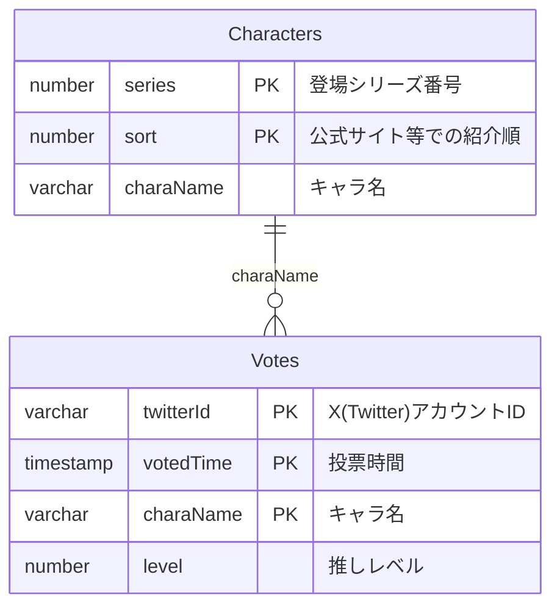
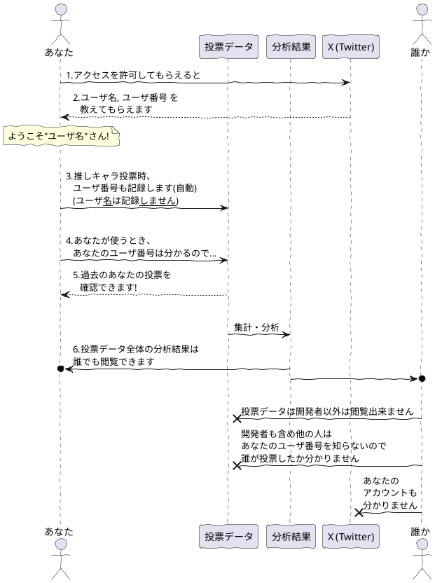
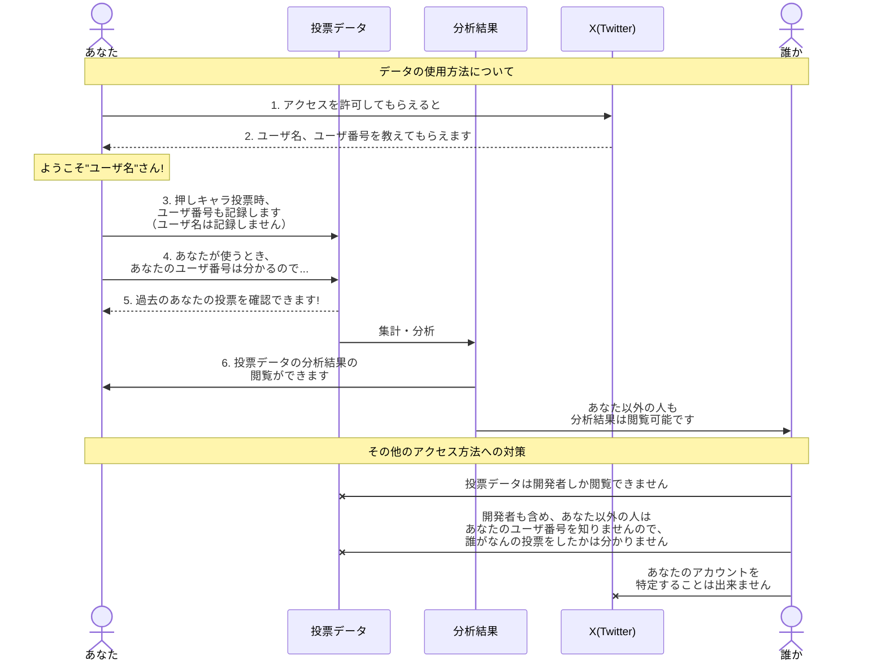

# Girl's Side Analysis 情報共有・分析サイト

# 背景
- 知り合いGSシリーズのファンが、X（旧Twitter）上で
他のファンと交流しています

- GSシリーズのある男子を好きな人は、他にどの男子が好きか気になるか...
言い換えれば、**推しの組み合わせは皆同じではなさそう**

- GSシリーズファン同士がSNSなどでやり取りをしていると自然と
察するものがあるらしく、**推しの組み合わせには何か傾向が有りそう**

- 公式の人気投票では、推しの組み合わせについての情報が得られない...
何か可視化できる**情報収集/結果表示の道具が欲しい**

- **GSシリーズファンの交流を助ける機能も**持ったWebアプリケーション
として開発できないだろうか？

- 本当のところサーバ維持費くらい稼ぎたいのですが、
稼ぎ方が分からない＆隣で見ていてGSシリーズが面白いので、
先ずは既に借りているサーバ内で動く範囲でやってみます

## アイディアメモ
- 次に攻略するキャラに悩んだ時のアイディアを出せるかも
- キャラの属性（先輩、先生、他校生 等...）を記録しておくことで、
  推しキャラのより大きな傾向をつかんでみたい気もします
  - 属性は公式に決まっているわけでない&唯一無二に近いものもあるので、
    認識違いなどの火種になるのは怖いかも...
    (王子、勉強、芸術...とかはアリかも)
- 「現実逃避ボタン」で認識したくない結果を非表示に出来たら精神的によさそうです
  (「そんな...私の推しキャラがこのキャラと一緒に表示されるなんて...」)

### 個別のアイディアについて
#### プレイ済みか、実況か等...
ユーザプロファイルにプレイ状況を表示出来たら面白そうですが、
どのキャラがプレイ中で、実況で、プレイ済みか選択させるのは
どこでおこなうべきでしょうか？

1. ユーザ画面
  - GS1~4のどれをプレイ済みか位はここで記録できそう
    ですが、キャラクターそれぞれについて全て選択するのは難しそう
  - 思ったのですが、GSシリーズを実際に持っていて
    推しキャラをまだプレイしていない状況なんてそうそうあるでしょうか？
    (真っ先に攻略しちゃいそう)
  - こっちの方がユーザの手間が少ないので有力候補
2. 推し登録時
  - 次に思いつくもっともらしいタイミングはここ。
    ただ、毎回プレイ済みかどうか入れるのってどうなのでしょう？
    最新の結果から分かる部分は予め自動入力することも可能ですが...
   
### 公式ページに載っていないキャラ
- GS1,3 で登場するバーのマスター、益田さん
 

# 開発記録
この部分は、新しい検討の方が上に来ます
## React.cache 関数の活用が出来ないか？
- トップページのレンダリングに一番コストが掛かっている
  - トップページのコンテンツは個別ページのコンテンツと重複するので
    出来れば個別ページの最終レンダリング時の結果を使用したい
- Botがトップページに定期的にアクセスしてくる

等の要因で、おおよそ1時間ごとに
キャラ70人分×過去30日分の集計×全投票データの走査 が行われて
想定より計算量がずっと多くなっている。

どうやらReact.cacheを使うとサーバサイドでの計算内容を
キャッシュすることが出来るらしい。
これとrevalidateTagを組み合わせて、
個別ページに投票された際に、そのキャラの投票データ取得キャッシュだけ
更新して、トップページも更新を掛けることができ、
計算量が低減するかもしれない。

前回ISRタイミングの最適化などを検討した際には、結局トップページの
再レンダリングにかかるコストが大きいことは変わらず、
更新頻度を落とせばその分負荷が下がる位のパッとしない成果しか
期待できないという考えに至った気がする。

今回はこの方法で上手くできるだろうか...
React.cacheってどの程度便利なのだろう？

- 個別ページのレンダリング時にReact.cacheを用いて30日分の
  そのキャラクター投票変化データをキャッシュ
- トップページではその結果を利用
- キャラクターの投票が有ったときのみキャッシュを更新すれば
  最低限の更新で成り立つかも...!!

React.cacheはリクエストを跨いではキャッシュされないので、
Next.jsのunstable\_cacheを使用するのが目的に適っていそう。

ただ、あるキャラクターについて投票が有ると、
関連する全てのキャラ？？をinvalidateする必要が有る気が...

キャラクタA,B,Cを推す人の投票が追加された場合...
A,B,Cの投票結果に影響が有るので、invalidateする必要がある

Dには関係あるか？→ない、投票に含まれるキャラクターのみinvalidateすればよい

unstable\_cacheの使い方を確認しているが、
実際に試してみないと挙動が分からない部分も多い

### 実験1. src/lib/vote.ts にキャッシュを定義
これは個別ページでrevalidatePathをしても更新されない。
キャッシュ機能はきちんと働いており、一度計算されたら再計算は無いみたい。

### 実験2. src/app/[charaName]/page.tsx のコンポーネント外にキャッシュを定義
挙動変わらず、別にrevalidatePathで再計算することが出来ていない。
revalidatePathってnon-asciiパスでもちゃんと動くんだろうか...

revalidatePath('/') はバッチリ動く。
ただ、新しい推しを追加で投票した際には想定通り動くが、
推しを削除した場合には「居なくなった推しのデータも更新する」
処理を出来ていないので基本的な設計からやり直さないといけない...

### 実験3. src/app/[charaName]/page.tsxのコンポーネント内にキャッシュを定義
毎回再計算される、公式のExample間違ってないかな？

### Ctrl+F5を押すと毎回再計算されるんですが...
productionモードで試した方が良いかもしれない

### unstable\_cacheはパスを跨いでは使えない
ので断念した、それならDB等の外部キャッシュが適当だろう

## ビルド方法の簡略化
ビルド時に本番環境サーバへのアクセスを必要とするので、
（ISRページの初回レンダリング時に本番データを反映するため）

注. APIエンドポイントを用意してデプロイ時に手動でrevalidatePathもあり

docker compose で dood を用いるなど他と比較して複雑。
ssh tunnelingで本番環境サーバにさくっと接続できないだろうか...
--network=host って使えなかったっけ？

→ 忘れていただけで、./docker-build-production.sh が使える。
docker-compose.prod.build.yml は必要以上に複雑だったので削除

## 分析データ更新タイミングについて
問題なのはトップページ。全員分×最新投票探索x過去30日間の分析が走るので
1時間毎のrevalidateで数秒間とはいえ100%負荷になってしまう

これを解消するため、revalidatePathをもっと積極的に使用したい。
公開当初と異なり今は更新頻度が下がっているので、
投票が新たに行われたらrevalidateするようにしたい。

ただし、頻繁に投票が行われる場合にはrevalidatePathをしたくない。
ということは、投票が行われた際に毎回「今回はrevalidateを行うか」を
チェックすればよさそう?

それだと短い間隔で2回アクセスが有った際、
後半の人はかなり待たされるのではないだろうか...
それならばthrottleがよいか？サーバサイドで使えるか？

→やはりだめそう

本当にやりたいことは計算負荷の削減であって
更新タイミングの制御ではないのでは？

計算負荷を下げる工夫であれば、最新の投票データを保持した
キャッシュテーブルが良いか？

整合性は誰がいつチェックするのか？
- トランザクションを用いればちょっとだけ安心できる
- 投票時にチェックできれば良いだろうか、
  最後のチェックから1日経過していれば整合性チェックを走らせるか

いや、これではまだダメ...
分析グラフは一定日毎の変化を計算しているから、
最新のデータだけでは対応できない

キャッシュするならまるごと？
→ 本来のデータの数倍の領域を使用するのはちょっと違う気がする...

実はこの実装が、現在やりたいことを最もバランスよく
実現しているのかもしれない......

## X(Twitter)認証の各種テスト
今の設定で動いているのは逆に不思議なくらいかも...?
- `AUTH_URL`環境変数を設定
- `next.config.js`でbasePathを設定 ← この時点でbasepath-redundant といった警告あり
- middlewareのmatcherには'/', と'/profile'を設定（後者のみでよいはず）
- 認証用エンドポイントはedgeランタイムでないとなぜか動かない

これらを修正していってどうなるか様子を見たい

どうやらリバースプロキシが存在しているため、
外から認証ページにアクセスするためのURLと、
Auth.jsがURL関連のパースを行うためのベースとなるURLとが
食い違っているのかも...

リバースプロキシ下で正しく使うのはやはり結構難しそう

- `AUTH_URL`は通常と異なる認証URLを使うときに必要そう、
  設定しないとtwitter oauthに渡す認証先URLが
  http://test.local/api/auth...になって、Twitter OAuth認証画面でエラー


## X(Twitter) API, OAuth認証の問題点
現在のFreeプランだと、ポストへのアクセスまでできてしまう
（そこまでいらない...）

また、X(Twitter)認証を行えるアプリがこの一つに限定されてしまう
多分他にはもう作ることはないが...

もしかすると自前でハッシュ化されたパスワードを保存しておくべきかも...

### 解決
OAuth認証で取得できる情報は何を使うかによって異なるので、
`src/auth.ts`の設定で`debug: true`としてその内容を確認し
（本当に色々表示されるので気を付けた方が良いくらい）、
それに合わせてmodule augumentationでProfile, JWT, Session型を拡張して、
`jwt`, `session`関数を適宜定義して内容を取得するとよさそう

## Next.jsの構成検討
当初は分析結果を全部まとめてStatic Renderingして返すことを
考えていましたが、先ずは表示したい分析結果をsearchParamsに入れておき、
サーバ側でDynamic Renderingしてもよいかもしれないです。

### もう少し考えたい
やはりユーザ1人1人のアクセスでDB集計をやり直すのは
ちょっと違う...?
新規登録時にはrevalidatePathをして集計をやり直し、
更新時には即時のDB集計を行わず、定期的な処理とするのは
どうでしょうか

→ `export const revalidate = 60 * 5;` で実現できそう?

でもキャラ毎のパスをstaticにするのは何か違う気もします。
とはいえdynamicなパスを設定するとstatic renderingにはならない様な？

→ `generateStaticParams()`を使う手が有るらしいです。
これはビルド時にパラメータを列挙して自動で複数のdynamic pathを
準備する機能の様に思われます。
キャラごとの集計結果をgenerateStaticParams()に持たせておいて...
revalidateと組み合わせられるのでしょうか？

→ できそうな感覚があります

[x] OK、できました！

## データベース構成の検討
ユーザが後から推しを変更したり、
コミュニティの異なる新規ユーザ群が登録を行ったりすることで
時系列で傾向が変化していく様子を追いかけられたら楽しそう。

複数の推しの組み合わせはいつも同時に登録されると仮定して
（具体的には一つのinsert文でいつもまとめて登録するようにして）、
twitterIDとtimestampを組みにして全ての新規追加・更新を同じテーブルに
記録してみます。

```sql
  SELECT
    twitter_id, 
    MAX(voted_time) as voted_time,
    charaName,
    level,
  FROM
    Votes
  WHERE
    voted_time < $specified_time
  GROUP BY twitter_id
  ;
```
...みたいなSQL文で時系列分析も出来るような気がする



## データベース構成の再検討
VotesのtwitterID, voteTimeをprimaryKeyにするつもりだったが、
同じtwitterID, voteTimeを持ったVotes複数個の組で
推しの組み合わせを表現することができない
→ characterNameもprimaryKeyに入れることで対処できるかも

## データベース分析方法
### 一番新しい投稿日時のデータのみ取り出す
```sql
select 
  * 
from 
  Votes as t1 
where 
  voted_time = (
    select 
      max(voted_time)
    from 
      Votes as t2 
    where 
      t1.twitter_id = t2.twitter_id
  )
;
```
...でできそう

### 推しキャラが関係するVotesだけ取り出す
```sql
select 
  * 
from 
  Votes as t1 
where 
  '柊夜ノ介' in (
    select 
      character_name
    from 
      Votes as t2 
    where 
      t1.twitter_id = t2.twitter_id 
      and 
      t1.voted_time = t2.voted_time
  )
;
```
...でできそう

### 推しキャラが関係するVotesのうち、投稿日時が一番新しいもののみを取り出す
```sql
select 
  * 
from 
  Votes as t1 
where 
  '柊夜ノ介' in (
    select 
      character_name
    from 
      Votes as t2 
    where 
      t1.twitter_id = t2.twitter_id 
      and 
      t1.voted_time = t2.voted_time
  ) 
  and 
  voted_time = (
    select 
      max(voted_time) 
    from 
      Votes as t3 
    where
      t1.twitter_id = t3.twitter_id
  );
```
...でできそう

### 推しキャラが関係するVotesのうち、投稿日時が一番新しいもののみを取り出して、しかも推しキャラ以外の情報だけを取り出す
```sql
select 
  * 
from 
  Votes as t1 
where 
  '柊夜ノ介' in (
    select 
      character_name
    from 
      Votes as t2 
    where 
      t1.twitter_id = t2.twitter_id 
      and 
      t1.voted_time = t2.voted_time
  ) 
  and 
  voted_time = (
    select 
      max(voted_time) 
    from 
      Votes as t3 
    where
      t1.twitter_id = t3.twitter_id
  )
  and
  character_name <> '柊夜ノ介'
;
```
...でできそう

### Drizzle ORM では 定数 in () をexistsを使って書き直す必要が有りそう...
```sql
select 
  * 
from 
  Votes as t1 
where 
  exists (
    select 
      character_name
    from 
      Votes as t2 
    where 
      t1.twitter_id = t2.twitter_id 
      and 
      t1.voted_time = t2.voted_time
      and
      t2.character_name = '柊夜ノ介'
  ) 
  and 
  voted_time = (
    select 
      max(voted_time) 
    from 
      Votes as t3 
    where
      t1.twitter_id = t3.twitter_id
  )
  and
  character_name <> '柊夜ノ介'
;
```
...でできそう

### 更にキャラクターごとに集計
```sql
select 
  character_name,
  count(*) as count 
from 
  Votes as t1 
where 
  exists (
    select 
      character_name
    from 
      Votes as t2 
    where 
      t1.twitter_id = t2.twitter_id 
      and 
      t1.voted_time = t2.voted_time
      and
      t2.character_name = '柊夜ノ介'
  ) 
  and 
  voted_time = (
    select 
      max(voted_time) 
    from 
      Votes as t3 
    where
      t1.twitter_id = t3.twitter_id
  )
  and
  character_name <> '柊夜ノ介'
group by
  character_name
;
```
...でできそう

[x] OK、できました！


## X (Twitter) アカウント使用方法についての説明
絵に出来たらもっと良いかもなのですが...
<details>
<summary>以前のPlantUMLの図</summary>



</details>

### アカウント情報使用方法



### ユーザのプレイ情報と投票結果をどうやって結びつけるか
意外と難しい...プレイ情報のうち、投票日時以前でも最も新しいものの
プレイ情報を取得する必要がります

### 推しキャラの組み合わせ投票画面をどうやって構成するか？
過去の最新の投票結果から初期状態を構成して、
- キャラのガーデンへの追加、退場
- おおよその推し順の変更

...ができる画面を作りたいですが、どうしましょうか

- ガーデンに入れているキャラとそのおおよその推し順をstateで保持します
- キャラの追加Select(TopCharacterSelectを流用)では
  既に追加されているキャラ名を追加済みとしたうえでdisabledにします
- 推し順は左右で表現、左が高くて右が低いです。
  同じ推し順なら最初に設定した方が上に表示されます

どうやって推し順を保持しましょうか...

### 投票画面構成の検討
最初に試している、先ずレベルごとに並び替える→同じレベルの中で
先に登録された順に並び替える...というのはDOM構造が変わるので、
恐らく順位変更ボタンを押すと急に位置が変わる様に見えるのでは...

それはあんまりかっこよくない気がします。

位置をスムーズに（アニメーションさせながら）変化させるためには、
表示位置の調整にDOM構造を用いてはいけない気がします。

→Framer Motionというライブラリが有るらしいです...
→色々試しましたが、コンポーネントがアンマウントされる
&DOMツリー構造が変化する場合には上手くいかなかったので、
relative要素内に放り込むことにし、素のCSSアニメーションを
用いることにしました。

### 一つの画面を複数のコンポーネントから構成するときの高さ指定方法検討
もしかしたらトップレベルのコンポーネントがgridレイアウトなどで高さを指定しないとカオスになるかも...

現在は入れ子になったコンポーネントが独自に高さ指定を行っているため
どの部分の数字を変えたら思った通りの結果になるのかわからない...

コンポーネントのサイズ指定は外から行うべきでしょうか...

controlled componentの投票用フォームもform要素に囲まれているのは
ちょっと不安になるかも...使い方を間違っていないでしょうか

基本的にh-fullを指定しつつ、その中身のサイズ配分は
子コンポーネントまかせ、というのが良いかも...

