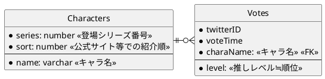

# Girl's Side Analysis ~情報共有・分析サイト~

# 背景
- 知り合いGSシリーズのファンで、X（旧Twitter）上で
他のファンと交流しています

- GSシリーズのある男子を好きな人は、他にどの男子が好きか気になるか...
言い換えれば、**推しの組み合わせは皆同じではなさそう**

- GSシリーズファン同士がSNSなどでやり取りをしていると自然と
察するものがあるらしく、**推しの組み合わせには何か傾向が有りそう**

- 公式の人気投票では、推しの組み合わせについての情報が得られない...
何か可視化できる**情報収集/結果表示の道具が欲しい**

- **GSシリーズファンの交流を助ける機能も**持ったWebアプリケーション
として開発できないだろうか？

- 本当のところサーバ維持費くらい稼ぎたいのですが、
稼ぎ方が分からない＆隣で見ていてGSシリーズが面白いので、
先ずは既に借りているサーバ内で動く範囲でやってみます

## アイディアメモ
- 次に攻略するキャラに悩んだ時のアイディアを出せるかも

# 開発記録

## Next.jsの構成検討
当初は分析結果を全部まとめてStatic Renderingして返すことを考えていたが、
先ずは表示したい分析結果をsearchParamsに入れておき、
サーバ側でDynamic Renderingしてもよいかもしれない。

### もう少し考えたい
やはりユーザ1人1人のアクセスでDB集計をやり直すのは
ちょっと違うのでは...
新規登録時にはrevalidatePathをして集計をやり直し、
更新時には即時のDB集計を行わず、定期的な処理とするのは
どうだろうか

→ `export const revalidate = 60 * 5;` で実現できそう?

でもキャラ毎のパスをstaticにするのは何か違う気もする。
とはいえdynamicなパスを設定するとstatic renderingにはならなかったのでは？

→ `generateStaticParams()`を使う手が有るらしい。
これはビルド時にパラメータを列挙して自動で複数のdynamic pathを
準備する機能の様に思われる。
キャラごとの集計結果をgenerateStaticParams()に持たせておいて...
revalidateと組み合わせられるのだろうか？

→ できそうな感覚がある

## データベース構成の検討
ユーザが後から推しを変更したり、
コミュニティの異なる新規ユーザ群が登録を行ったりすることで
時系列で傾向が変化していく様子を追いかけられたら楽しそう。

複数の推しの組み合わせはいつも同時に登録されると仮定して
（具体的には一つのinsert文でいつもまとめて登録するようにして）、
twitterIDとtimestampを組みにして全ての新規追加・更新を同じテーブルに
記録してみる。

```sql
  SELECT
    twitter_id, 
    MAX(voted_time) as voted_time,
    charaName,
    level,
  FROM
    Votes
  WHERE
    voted_time < $specified_time
  GROUP BY twitter_id
  ;
```
...みたいなSQL文で時系列分析も出来るような気がする



## データベース構成の再検討
VotesのtwitterID, voteTimeをprimaryKeyにするつもりだったが、
同じtwitterID, voteTimeを持ったVotes複数個の組で
推しの組み合わせを表現することができない
→ characterNameもprimaryKeyに入れることで対処できるかも

## データベース分析方法
### 一番新しい投稿日時のデータのみ取り出す
```sql
select 
  * 
from 
  Votes as t1 
where 
  voted_time = (
    select 
      max(voted_time)
    from 
      Votes as t2 
    where 
      t1.twitter_id = t2.twitter_id
  )
;
```
...でできそう

### 推しキャラが関係するVotesだけ取り出す
```sql
select 
  * 
from 
  Votes as t1 
where 
  '柊夜ノ介' in (
    select 
      character_name
    from 
      Votes as t2 
    where 
      t1.twitter_id = t2.twitter_id 
      and 
      t1.voted_time = t2.voted_time
  )
;
```
...でできそう

### 推しキャラが関係するVotesのうち、投稿日時が一番新しいもののみを取り出す
```sql
select 
  * 
from 
  Votes as t1 
where 
  '柊夜ノ介' in (
    select 
      character_name
    from 
      Votes as t2 
    where 
      t1.twitter_id = t2.twitter_id 
      and 
      t1.voted_time = t2.voted_time
  ) 
  and 
  voted_time = (
    select 
      max(voted_time) 
    from 
      Votes as t3 
    where
      t1.twitter_id = t3.twitter_id
  );
```
...でできそう

### 推しキャラが関係するVotesのうち、投稿日時が一番新しいもののみを取り出して、しかも推しキャラ以外の情報だけを取り出す
```sql
select 
  * 
from 
  Votes as t1 
where 
  '柊夜ノ介' in (
    select 
      character_name
    from 
      Votes as t2 
    where 
      t1.twitter_id = t2.twitter_id 
      and 
      t1.voted_time = t2.voted_time
  ) 
  and 
  voted_time = (
    select 
      max(voted_time) 
    from 
      Votes as t3 
    where
      t1.twitter_id = t3.twitter_id
  )
  and
  character_name <> '柊夜ノ介'
;
```
...でできそう

