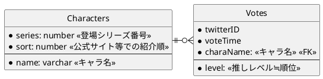
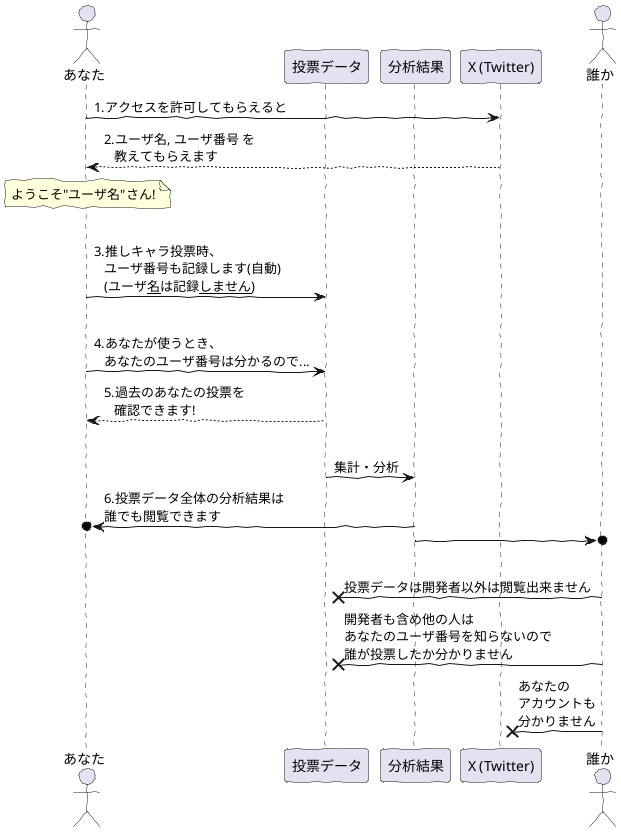

# Girl's Side Analysis 情報共有・分析サイト

# 背景
- 知り合いGSシリーズのファンで、X（旧Twitter）上で
他のファンと交流しています

- GSシリーズのある男子を好きな人は、他にどの男子が好きか気になるか...
言い換えれば、**推しの組み合わせは皆同じではなさそう**

- GSシリーズファン同士がSNSなどでやり取りをしていると自然と
察するものがあるらしく、**推しの組み合わせには何か傾向が有りそう**

- 公式の人気投票では、推しの組み合わせについての情報が得られない...
何か可視化できる**情報収集/結果表示の道具が欲しい**

- **GSシリーズファンの交流を助ける機能も**持ったWebアプリケーション
として開発できないだろうか？

- 本当のところサーバ維持費くらい稼ぎたいのですが、
稼ぎ方が分からない＆隣で見ていてGSシリーズが面白いので、
先ずは既に借りているサーバ内で動く範囲でやってみます

## アイディアメモ
- 次に攻略するキャラに悩んだ時のアイディアを出せるかも
- キャラの属性（先輩、先生、他校生 等...）を記録しておくことで、
  推しキャラのより大きな傾向をつかんでみたい気もします
  - 属性は公式に決まっているわけでない&唯一無二に近いものもあるので、
    認識違いなどの火種になるのは怖いかも...
    (王子、勉強、芸術...とかはアリかも)
- 「現実逃避ボタン」で認識したくない結果を非表示に出来たら精神的によさそうです
  (「そんな...私の推しキャラがこのキャラと一緒に表示されるなんて...」)

### 個別のアイディアについて
#### プレイ済みか、実況か等...
ユーザプロファイルにプレイ状況を表示出来たら面白そうですが、
どのキャラがプレイ中で、実況で、プレイ済みか選択させるのは
どこでおこなうべきでしょうか？

1. ユーザ画面
  - GS1~4のどれをプレイ済みか位はここで記録できそう
    ですが、キャラクターそれぞれについて全て選択するのは難しそう
  - 思ったのですが、GSシリーズを実際に持っていて
    推しキャラをまだプレイしていない状況なんてそうそうあるでしょうか？
    (真っ先に攻略しちゃいそう)
  - こっちの方がユーザの手間が少ないので有力候補
2. 推し登録時
  - 次に思いつくもっともらしいタイミングはここ。
    ただ、毎回プレイ済みかどうか入れるのってどうなのでしょう？
    最新の結果から分かる部分は予め自動入力することも可能ですが...
   
### 公式ページに載っていないキャラ
- GS1,3 で登場するバーのマスター、増田さん
 

# 開発記録
この部分は、新しい検討の方が上に来ます

## X(Twitter) API, OAuth認証の問題点
現在のFreeプランだと、ポストへのアクセスまでできてしまう
（そこまでいらない...）

また、X(Twitter)認証を行えるアプリがこの一つに限定されてしまう
多分他にはもう作ることはないが...

もしかすると自前でハッシュ化されたパスワードを保存しておくべきかも...

### 解決
OAuth認証で取得できる情報は何を使うかによって異なるので、
`src/auth.ts`の設定で`debug: true`としてその内容を確認し
（本当に色々表示されるので気を付けた方が良いくらい）、
それに合わせてmodule augumentationでProfile, JWT, Session型を拡張して、
`jwt`, `session`関数を適宜定義して内容を取得するとよさそう

## Next.jsの構成検討
当初は分析結果を全部まとめてStatic Renderingして返すことを
考えていましたが、先ずは表示したい分析結果をsearchParamsに入れておき、
サーバ側でDynamic Renderingしてもよいかもしれないです。

### もう少し考えたい
やはりユーザ1人1人のアクセスでDB集計をやり直すのは
ちょっと違う...?
新規登録時にはrevalidatePathをして集計をやり直し、
更新時には即時のDB集計を行わず、定期的な処理とするのは
どうでしょうか

→ `export const revalidate = 60 * 5;` で実現できそう?

でもキャラ毎のパスをstaticにするのは何か違う気もします。
とはいえdynamicなパスを設定するとstatic renderingにはならない様な？

→ `generateStaticParams()`を使う手が有るらしいです。
これはビルド時にパラメータを列挙して自動で複数のdynamic pathを
準備する機能の様に思われます。
キャラごとの集計結果をgenerateStaticParams()に持たせておいて...
revalidateと組み合わせられるのでしょうか？

→ できそうな感覚があります

[x] OK、できました！

## データベース構成の検討
ユーザが後から推しを変更したり、
コミュニティの異なる新規ユーザ群が登録を行ったりすることで
時系列で傾向が変化していく様子を追いかけられたら楽しそう。

複数の推しの組み合わせはいつも同時に登録されると仮定して
（具体的には一つのinsert文でいつもまとめて登録するようにして）、
twitterIDとtimestampを組みにして全ての新規追加・更新を同じテーブルに
記録してみます。

```sql
  SELECT
    twitter_id, 
    MAX(voted_time) as voted_time,
    charaName,
    level,
  FROM
    Votes
  WHERE
    voted_time < $specified_time
  GROUP BY twitter_id
  ;
```
...みたいなSQL文で時系列分析も出来るような気がする



## データベース構成の再検討
VotesのtwitterID, voteTimeをprimaryKeyにするつもりだったが、
同じtwitterID, voteTimeを持ったVotes複数個の組で
推しの組み合わせを表現することができない
→ characterNameもprimaryKeyに入れることで対処できるかも

## データベース分析方法
### 一番新しい投稿日時のデータのみ取り出す
```sql
select 
  * 
from 
  Votes as t1 
where 
  voted_time = (
    select 
      max(voted_time)
    from 
      Votes as t2 
    where 
      t1.twitter_id = t2.twitter_id
  )
;
```
...でできそう

### 推しキャラが関係するVotesだけ取り出す
```sql
select 
  * 
from 
  Votes as t1 
where 
  '柊夜ノ介' in (
    select 
      character_name
    from 
      Votes as t2 
    where 
      t1.twitter_id = t2.twitter_id 
      and 
      t1.voted_time = t2.voted_time
  )
;
```
...でできそう

### 推しキャラが関係するVotesのうち、投稿日時が一番新しいもののみを取り出す
```sql
select 
  * 
from 
  Votes as t1 
where 
  '柊夜ノ介' in (
    select 
      character_name
    from 
      Votes as t2 
    where 
      t1.twitter_id = t2.twitter_id 
      and 
      t1.voted_time = t2.voted_time
  ) 
  and 
  voted_time = (
    select 
      max(voted_time) 
    from 
      Votes as t3 
    where
      t1.twitter_id = t3.twitter_id
  );
```
...でできそう

### 推しキャラが関係するVotesのうち、投稿日時が一番新しいもののみを取り出して、しかも推しキャラ以外の情報だけを取り出す
```sql
select 
  * 
from 
  Votes as t1 
where 
  '柊夜ノ介' in (
    select 
      character_name
    from 
      Votes as t2 
    where 
      t1.twitter_id = t2.twitter_id 
      and 
      t1.voted_time = t2.voted_time
  ) 
  and 
  voted_time = (
    select 
      max(voted_time) 
    from 
      Votes as t3 
    where
      t1.twitter_id = t3.twitter_id
  )
  and
  character_name <> '柊夜ノ介'
;
```
...でできそう

### Drizzle ORM では 定数 in () をexistsを使って書き直す必要が有りそう...
```sql
select 
  * 
from 
  Votes as t1 
where 
  exists (
    select 
      character_name
    from 
      Votes as t2 
    where 
      t1.twitter_id = t2.twitter_id 
      and 
      t1.voted_time = t2.voted_time
      and
      t2.character_name = '柊夜ノ介'
  ) 
  and 
  voted_time = (
    select 
      max(voted_time) 
    from 
      Votes as t3 
    where
      t1.twitter_id = t3.twitter_id
  )
  and
  character_name <> '柊夜ノ介'
;
```
...でできそう

### 更にキャラクターごとに集計
```sql
select 
  character_name,
  count(*) as count 
from 
  Votes as t1 
where 
  exists (
    select 
      character_name
    from 
      Votes as t2 
    where 
      t1.twitter_id = t2.twitter_id 
      and 
      t1.voted_time = t2.voted_time
      and
      t2.character_name = '柊夜ノ介'
  ) 
  and 
  voted_time = (
    select 
      max(voted_time) 
    from 
      Votes as t3 
    where
      t1.twitter_id = t3.twitter_id
  )
  and
  character_name <> '柊夜ノ介'
group by
  character_name
;
```
...でできそう

[x] OK、できました！


## X (Twitter) アカウント使用方法についての説明
絵に出来たらもっと良いかもなのですが...




### ユーザのプレイ情報と投票結果をどうやって結びつけるか
意外と難しい...プレイ情報のうち、投票日時以前でも最も新しいものの
プレイ情報を取得する必要がある

